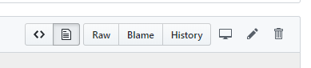
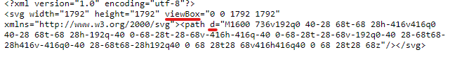

<h1 align="center">Striven Editor</h1>

<p align="center">
    
</p>

<p align="center">


</p>

## Getting Started

### Install Package

```sh
$ npm install striven-editor
```

### Initialize Editor

```js
import { StrivenEditor } from 'striven-editor';

const editor = new StrivenEditor(editorEl);
```

### Passing Options to the Editor

```js
import StrivenEditor from 'striven-editor';

const editor = new StrivenEditor(editorEl, { toolbarHide: true, toolbarBottom: true });
```

## Fetching Meta Data on Link Insertions

To fetch meta data from links that are pasted or inserted into the editor, you must set up a back end utility to fetch the data and send it back to your client. For a node server, we recommend using [metascraper](https://metascraper.js.org/#/) on your server. See the example below for setting this up with express.

```js
const got = require('got');
const app = require('express')();
const bodyParser = require('body-parser');
const metascraper = require('metascraper')([
    require('metascraper-description')(),
    require('metascraper-image')(),
    require('metascraper-title')(),
    require('metascraper-url')()
]);

app.use(bodyParser.json());
app.use(bodyParser.urlencoded({ extended: true }));

app.post('/meta', (req, res) => {
    const targetUrl = req.body.targetUrl;
    if(targetUrl) {
        (async () => {
            const { body: html, url } = await got(targetUrl);
            const metadata = await metascraper({ html, url });
            res.send(metadata);
        })()
    } else {
        res.sendStatus(400);
    }
})

app.listen(8080, () => console.log('Server is on.'));
```

Your editor should look something like this.

```js
const editor = new StrivenEditor(editorEl, { metaUrl: 'http://localhost:8080/meta' });
```

### Meta Data POST Request

Here is an example of what the editor uses for the client to make a ```POST``` request to the server.

```js
fetch(this.options.metaUrl, {
    method: "POST",
    headers: { 'Content-Type': 'application/json' },
    body: JSON.stringify({ targetUrl: url })
}).then((res) => res.json())
```

## Writing Encoded Images to a Server

**Passing ```imageUrl``` will disable the use of ```uploadOnPaste```**

Using Node's [File System](https://nodejs.org/api/fs.html), you can send encoded image data to your server and send the editor a reference to those files. See the example below for doing this on an express server.

```js
const express = require('express');
const app = express();
const PORT = 4200;
const path = require('path');
const bodyParser = require('body-parser');
const cors = require('cors');
const fs = require('fs');
const shortid = require('shortid');

app.use(bodyParser.json());
app.use(cors());

app.get('/images/:name', (req, res) => {
    res.sendFile(path.join(__dirname, 'images', req.params.name));
})

app.post('/image', (req, res) => {
    const imageEncoding = req.body.imageEncoding;
    try {
        const base64Image = imageEncoding.split(';base64,').pop();
        const imageId = shortid.generate();

        fs.writeFile(path.join(__dirname, 'images', `${imageId}.png`), base64Image, {encoding: 'base64'}, function(err) {
            console.log('File created');
            res.send({ imageRef: `http://localhost:${PORT}/images/${imageId}.png` });
            err && console.log(err);
        });
    } 
    catch (e) {
        res.sendStatus(400);
    }
})

app.listen(PORT, () => console.log(`Image server open on port: ${PORT}`))
```

### Handling the Image Reference

Here is an example of what the editor uses for the client to make a ```POST``` request to the server. If the server returns an error, the editor will paste the image as normal.

```js
fetch(this.options.imageUrl, {
    method: "POST",
    headers: { 'Content-Type': 'application/json' },
    body: JSON.stringify({ imageEncoding })
}).then((res) => res.json())
```

## Toolbar Options

Specify which options to display in the toolbar and allow for use in the editor.

```js
const editor = new StrivenEditor(editorEl, { toolbarOptions: ["bold", "italic", "underline"] })
```

### List of Toolbar Options

* bold
* italic
* underline
* strikethrough
* removeFormat
* insertOrderedList
* insertUnorderedList
* indent
* justifyLeft
* justifyCenter
* justifyRight
* attachment
* link
* image

### Passing Custom Toolbar Options

```js
const customToolbarOption = { 
    icon: { 
        viewBox: "0 0 1792 1792", 
        d: "M1600 736v192q0 40-28 68t-68 28h-416v416q0 40-28 68t-68 28h-192q-40 0-68-28t-28-68v-416h-416q-40 0-68-28t-28-68v-192q0-40 28-68t68-28h416v-416q0-40 28-68t68-28h192q40 0 68 28t28 68v416h416q40 0 68 28t28 68z"
    },
    handler: () => this.editor.getRange().insertNode(document.createTextNode("hello world"))
};

const editor = new StrivenEditor(editorEl, { toolbarOptions: ["bold", "italic", "underline", customToolbarOption] });
```

#### Finding SVG Data

You can find Raw Fontawesome SVG data [here](https://github.com/encharm/Font-Awesome-SVG-PNG/tree/master/black/svg). After finding the icon you want, view the SVG file as raw.



Then take the SVG element's ```viewBox``` attribute data and the path element's ```d``` attribute data.



## Editor Options

|Option|Type|Default|Description|
|:-:|:-:|:-:|:-:|
|toolbarHide|```Boolean```|```false```|Enable the toolbar slide animation|
|toolbarBottom|```Boolean```|```false```|Render the toolbar beneath the editor|
|minimal|```Boolean```|```false```|Display minimal editor options|
|onToolbarSend|```Function```|```null```|Handler for when the send icon is clicked. If defined, show the toolbar send icon.|
|metaUrl|```String```|```null```|An endpoint to make a ```POST``` request for a urls metadata. <br /> See [Fetching Metadata](#meta-data-post-request)|
|extensions|```Array``` of ```String```|```[ ".doc", ".docx", ".xls", ".xlsx", ".ppt", ".pptx", ".pdf",".tif", ".jpeg", ".jpg", ".gif", ".bmp", ".txt", ".csv", ".png", ".msg", ".wav", ".mp3", ".mp4", ".zip", ".rtf", ".eps", ".ai", ".psd", ".avi", ".mov", ".wmv", ".cfg", ".wss", ".vsd", ".vsdx", ".tsd", ".lic" ]```|An array of file extensions allowed for upload|
|uploadOnPaste|```Boolean```|```false```|Enable uploading images on paste.|
|toolbarOptionFillColor|```String```|```#333```|Fill color for the toolbar option SVGs|
|placeholder|```String```|None|Default text to display when the editor is empty|
|sanitizePaste|```Boolean```|```false```|*Clean* pasted content of any HTML styles|
|imageUrl|```String```|```null```|An endpoint to make a ```POST``` request for writing encoded images to the server. <br /> See [Referencing Encoded Images](#meta-data-post-request)|

## Editor Methods

|Method|Return Type|Description|
|:-:|:-:|:-:|
|getFiles|```Array``` of ```File```|Returns an Array of Files attached to the editor|
|getContent|```String```|Returns an HTML String of the editor's contents|
|setContent(```String```)|None|Set the editor ```innerHTML``` content by passing an HTML string|
|clearContent|None|Clear the editor of its current contents|
|getRange|```Range```|Get the current [Range](https://developer.mozilla.org/en-US/docs/Web/API/Range) of the window at index ```0```|
|attachFile(```File```)|None|Attaches given file to the editor|
|openLinkMenu|None|Opens the ```insertLink``` menu|
|closeLinkMenu|None|Closes the ```insertLink``` menu|
|openImageMenu|None|Opens the ```insertImage``` menu|
|closeImageMenu|None|Closes the ```insertImage``` menu|
|overflow|None|Manually update the editor to handle overflow content <br /> ```overflowX``` ```overflowY```|
|getMeta(```String```)|```Promise```|Returns a promise containing data from ```POST``` request to ```metaURl``` using the passed url as ```targetUrl``` <br /> ```const { url, title, image, description } = res```|
|getImage(```String```)|```Promise```|Returns a promise containing data from ```POST``` request to ```imageUrl``` and passes ```imageEncoding``` in the body <br /> ```const { imageRef } = res```|
|toolbarSlideUp|None|Manually trigger the toolbar open animation|
|toolbarSlideDown|None|Manually trigger the toolbar close animation|
|getTextContent|```String```|Returns the text content of the editor with no HTML|
