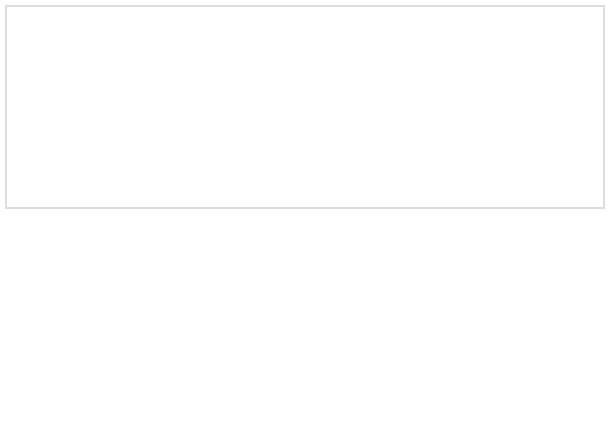

# Striven Editor


💼 [Striven](https://striven.com/)
|
📝 [Demo](#)



## Getting Started

```sh
$ npm install striven-editor
```

```js
import StrivenEditor from 'striven-editor';

const editor = new StrivenEditor(editorEl);
```